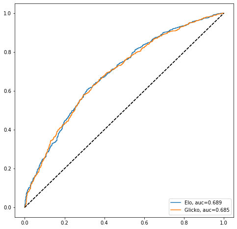

# Rating Systems

Implementation of the rating systems to rank sports teams.

## Available

- Elo
	- `logistic` (logistic decay of score difference)
	- `power` (power decay of score difference)
	- `fte` ([FiveThirtyEight](https://fivethirtyeight.com/methodology/how-our-nfl-predictions-work/) calculation)
- Glicko

## Usage

If we are interested in just running the ratings for a specific matchup, we can call the rating objects:

```python
### initialize rating with parameters
elo = Elo(h=70)
glicko = Glicko(c=42.43, sigma_min=30)
```

Additionally, we can also run the ratings for historical data, stored as `pandas DataFrame`:

```python
## using Elo:
elo = Rate(model=Elo, season_regress=0.33)
elo.rate_fixtures(train=fixtures)

## using Glicko:
glicko = Rate(model=Glicko, c=10)
glicko.rate_Fixtures(train=fixtures)
```

## Ratings Performance

You can plot the ROC curve for one or multiple models:

```python
plt.figure(figsize=(8,8))
elo.plot_roc_curve()
glicko.plot_roc_curve()
plt.show()
```



## Optimization
